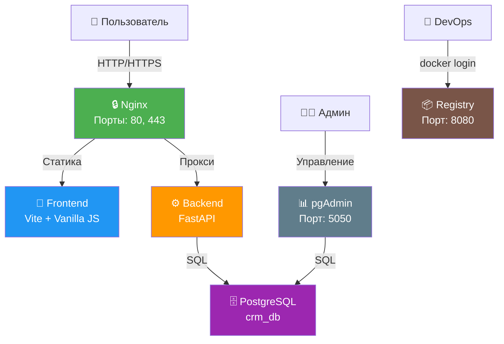

# Orders CRM

Премиальная CRM-система для управления заявками тёплых клиентов.

## Архитектура



## Структура проекта

```
OrdersCRM/
── frontend/               # Фронтенд (Vite + Vanilla JS)
│   ├── dist/               # Сборка для продакшена
│   ├── src/
│   │   ├── main.js         # Точка входа
│   │   ├── api/            # API запросы
│   │   ├── tracking/       # Трекинг поведения
│   │   ├── components/     # UI компоненты
│   │   └── styles/         # CSS стили
│   ├── index.html
│   ├── package.json
│   └── vite.config.js
├── backend/                # Бэкенд (FastAPI)
│   ├── app/
│   │   ├── main.py         # FastAPI приложение
│   │   ├── core/           # Конфигурация
│   │   ├── models/         # SQLAlchemy модели
│   │   └── routes/         # API роуты
│   ├── db/init.sql         # Инициализация БД
│   ├── nginx/              # Конфигурация Nginx
│   ├── registry/           # Docker Registry
│   ├── docker-compose.yml
│   ├── Dockerfile
│   └── requirements.txt
── docs/                   # Документация
```

## Быстрый старт

### 1. Клонирование

```bash
git clone https://github.com/MatveiV/OrdersCRM.git
cd OrdersCRM
```

### 2. Запуск бэкенда

```bash
cd backend
docker compose up -d --build
```

### 3. Сборка фронтенда

```bash
cd frontend
npm install
npm run build
```

### 4. Деплой фронтенда

```bash
# Копирование файлов на сервер
scp -r dist/* root@185.87.48.13:/root/orders-crm-frontend/

# Копирование в nginx контейнер
ssh root@185.87.48.13 "docker cp /root/orders-crm-frontend/index.html orderscrm_nginx:/usr/share/nginx/html/"
ssh root@185.87.48.13 "docker cp /root/orders-crm-frontend/assets orderscrm_nginx:/usr/share/nginx/html/"
ssh root@185.87.48.13 "docker restart orderscrm_nginx"
```

## Доступ к сервисам

| Сервис | URL | Логин | Пароль |
|--------|-----|-------|--------|
| Сайт | http://185.87.48.13 | - | - |
| Swagger Docs | http://185.87.48.13/docs | - | - |
| pgAdmin | http://185.87.48.13:5050 | admin@orderscrm.ru | admin123 |
| Registry | http://185.87.48.13:8080 | admin | crm_password |
| PostgreSQL | 185.87.48.13:5432 | crm_user | crm_password |

## API Endpoints

### Leads

| Метод | Путь | Описание |
|-------|------|----------|
| POST | `/api/leads/` | Создать лид |
| GET | `/api/leads/` | Список лидов |
| GET | `/api/leads/{id}` | Получить лид |
| PUT | `/api/leads/{id}` | Обновить лид |
| DELETE | `/api/leads/{id}` | Удалить лид |

### Behaviors

| Метод | Путь | Описание |
|-------|------|----------|
| POST | `/api/behaviors/` | Создать поведение |
| GET | `/api/behaviors/` | Список поведений |
| GET | `/api/behaviors/{lead_id}` | Получить поведение |
| PUT | `/api/behaviors/{lead_id}` | Обновить поведение |
| DELETE | `/api/behaviors/{lead_id}` | Удалить поведение |

### Admin

| Метод | Путь | Описание |
|-------|------|----------|
| POST | `/api/admin/` | Создать конфиг |
| GET | `/api/admin/` | Список конфигов |
| GET | `/api/admin/active` | Активный конфиг |
| GET | `/api/admin/{id}` | Получить конфиг |
| PUT | `/api/admin/{id}` | Обновить конфиг |
| DELETE | `/api/admin/{id}` | Удалить конфиг |

### Health

| Метод | Путь | Описание |
|-------|------|----------|
| GET | `/health` | Проверка статуса |

## Фронтенд

### Технологии

- **Сборка:** Vite
- **Стили:** Чистый CSS (Glassmorphism)
- **Шрифты:** Cormorant Garamond + Inter (Google Fonts)
- **Анимации:** CSS + легковесный JS

### Дизайн

- Тёмный фон с золотыми акцентами (#D4AF37, #FFD700)
- Glassmorphism эффект для формы
- Анимированные золотые частицы на фоне
- Адаптивная вёрстка (mobile, tablet, desktop)

### Функционал

- Динамическая загрузка настроек из AdminData
- Трекинг поведения пользователя (время, клики, скролл)
- Валидация формы на клиенте
- Отправка единого пакета (lead + behavior)

### Команды

```bash
npm install      # Установка зависимостей
npm run dev      # Запуск dev-сервера
npm run build    # Сборка в dist/
npm run preview  # Предпросмотр сборки
```

## Бэкенд

### Технологии

- **Фреймворк:** FastAPI
- **База данных:** PostgreSQL 16
- **ORM:** SQLAlchemy (async)
- **Валидация:** Pydantic

### Модели данных

**Lead** — основная заявка клиента:
- first_name, last_name, middle_name
- contact_data, business_niche, company_size
- task_volume, role, business_info
- budget, project_deadline, task_type
- product_interest, preferred_contact_method
- convenient_time, comment

**Behavior** — поведение пользователя (1-к-1 с Lead):
- lead_id (FK), time_spent_seconds
- buttons_clicked, cursor_hover_zones
- return_count, page_views, scroll_depth_percent
- device_type, browser, os, screen_resolution
- ip_address, user_agent, referrer
- utm_source, utm_medium, utm_campaign

**AdminData** — настройки для фронтенда:
- service_name, budget_range
- available_products, contact_methods
- form_settings, ui_config

## Docker Registry

```bash
# Логин
docker login 185.87.48.13:8080
# Username: admin
# Password: crm_password

# Пуш образа
docker tag my-image:latest 185.87.48.13:8080/my-image:latest
docker push 185.87.48.13:8080/my-image:latest
```

## Безопасность

- Backend недоступен напрямую извне
- Все запросы проходят через Nginx
- PostgreSQL доступен только внутри Docker сети
- Данные не покидают сервер
- Аутентификация в Registry через htpasswd

## Мониторинг

```bash
# Логи всех сервисов
docker compose logs -f

# Логи конкретного сервиса
docker compose logs -f backend

# Статистика ресурсов
docker stats

# Проверка здоровья PostgreSQL
docker compose exec postgres pg_isready -U crm_user -d crm_db
```

## Резервное копирование

```bash
# Бэкап базы данных
docker compose exec postgres pg_dump -U crm_user crm_db > backup.sql

# Восстановление
docker compose exec -T postgres psql -U crm_user crm_db < backup.sql
```
