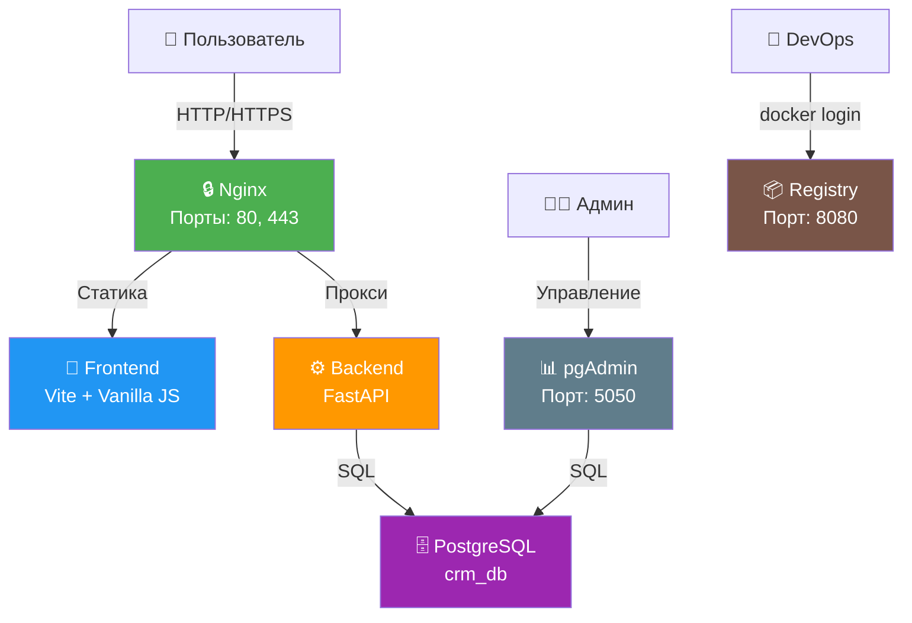

# Orders CRM — Документация

Премиальная CRM-система для управления заявками тёплых клиентов.

## Версии документации

| Версия | Дата | Описание |
|--------|------|----------|
| [v1.0](#v10-2026-05-16) | 2026-05-16 | Инициализация проекта, базовая архитектура, FastAPI + PostgreSQL |
| [v1.1](#v11-2026-05-17) | 2026-05-17 | Добавлен фронтенд (Vite + Vanilla JS), Glassmorphism UI, трекинг поведения |
| [v1.2](#v12-2026-05-21) | 2026-05-21 | HTTPS, клиентский лендинг, админ-панель /admin, C4/UML диаграммы |

---

## v1.2 (2026-05-21)

### Что нового

- **HTTPS** — самоподписанный SSL-сертификат, HTTP→HTTPS redirect, security headers
- **Клиентский лендинг** (`/`) — Hero-секция, портфолио проектов, форма заявки
- **Админ-панель** (`/admin`) — перенесена старая форма на отдельный маршрут
- **Дизайн-система** — светлая тема, Nunito/Nunito Sans/Comfortaa, золотые акценты
- **Портфолио** — 13 карточек проектов с фильтрацией по категориям
- **C4 и UML диаграммы** — полная визуализация архитектуры

### Маршруты

| Маршрут | Описание |
|---------|----------|
| `/` | Клиентский лендинг (Hero + Проекты + Форма) |
| `/admin` | Админ-панель (старая форма заявки) |
| `/api/leads/` | CRUD лидов |
| `/api/behaviors/` | CRUD поведений |
| `/api/admin/active` | Активные настройки фронтенда |
| `/docs` | Swagger UI |
| `/health` | Health check |

### Диаграммы

- [C4 Context Diagram](docs/diagrams/c4-context.md)
- [C4 Container Diagram](docs/diagrams/c4-container.md)
- [C4 Component Diagram](docs/diagrams/c4-component.md)
- [UML Sequence — Lead Submission](docs/diagrams/uml-sequence-lead.md)
- [UML Class Diagram](docs/diagrams/uml-class.md)
- [UML ER Diagram](docs/diagrams/uml-er.md)

---

## v1.1 (2026-05-17)

### Что нового

- **Фронтенд** — Vite + Vanilla JS, Glassmorphism UI
- **Трекинг поведения** — время на странице, клики, скролл, возвраты
- **Динамические формы** — загрузка настроек из AdminData
- **Анимации** — CSS + легковесный JS, золотые частицы
- **Docker Registry** — локальный реестр образов на порту 8080

### Фронтенд

- Сборка: `npm run build` → `dist/`
- Стили: Glassmorphism, тёмная тема, золотые акценты
- Шрифты: Cormorant Garamond + Inter
- Адаптивность: mobile, tablet, desktop

### Бэкенд

- Модели: Lead, Behavior (1:1), AdminData
- Async SQLAlchemy + asyncpg
- Pydantic валидация

---

## v1.0 (2026-05-16)

### Что нового

- **Инициализация проекта** — базовая структура
- **FastAPI бэкенд** — CRUD API для лидов
- **PostgreSQL 16** — основная БД
- **Docker Compose** — оркестрация сервисов
- **Nginx** — проксирование API, раздача статики
- **pgAdmin** — управление БД

### Архитектура



---

## Быстрый старт

### 1. Клонирование

```bash
git clone https://github.com/MatveiV/OrdersCRM.git
cd OrdersCRM
```

### 2. Запуск бэкенда

```bash
cd backend
docker compose up -d --build
```

### 3. Сборка фронтенда (клиентский лендинг)

```bash
cd frontend-client
npm install
npm run build
```

### 4. Сборка админ-панели

```bash
cd frontend
npm install
npm run build
```

### 5. Деплой

```bash
# Копирование файлов на сервер
scp -r frontend-client/dist/* root@185.87.48.13:/tmp/
scp -r frontend/dist/* root@185.87.48.13:/tmp/admin/

# Копирование в nginx контейнер
ssh root@185.87.48.13 "docker cp /tmp/. orderscrm_nginx:/usr/share/nginx/html/"
ssh root@185.87.48.13 "docker cp /tmp/admin/. orderscrm_nginx:/usr/share/nginx/html/admin/"
ssh root@185.87.48.13 "docker restart orderscrm_nginx"
```

## Доступ к сервисам

| Сервис | URL | Логин | Пароль |
|--------|-----|-------|--------|
| Лендинг | https://185.87.48.13 | - | - |
| Админ-панель | https://185.87.48.13/admin | - | - |
| Swagger Docs | https://185.87.48.13/docs | - | - |
| pgAdmin | https://185.87.48.13:5050 | admin@orderscrm.ru | admin123 |
| Registry | https://185.87.48.13:8080 | admin | crm_password |
| PostgreSQL | 185.87.48.13:5432 | crm_user | crm_password |

## API Endpoints

### Leads

| Метод | Путь | Описание |
|-------|------|----------|
| POST | `/api/leads/` | Создать лид |
| GET | `/api/leads/` | Список лидов |
| GET | `/api/leads/{id}` | Получить лид |
| PUT | `/api/leads/{id}` | Обновить лид |
| DELETE | `/api/leads/{id}` | Удалить лид |

### Behaviors

| Метод | Путь | Описание |
|-------|------|----------|
| POST | `/api/behaviors/` | Создать поведение |
| GET | `/api/behaviors/` | Список поведений |
| GET | `/api/behaviors/{lead_id}` | Получить поведение |
| PUT | `/api/behaviors/{lead_id}` | Обновить поведение |
| DELETE | `/api/behaviors/{lead_id}` | Удалить поведение |

### Admin

| Метод | Путь | Описание |
|-------|------|----------|
| POST | `/api/admin/` | Создать конфиг |
| GET | `/api/admin/` | Список конфигов |
| GET | `/api/admin/active` | Активный конфиг |
| GET | `/api/admin/{id}` | Получить конфиг |
| PUT | `/api/admin/{id}` | Обновить конфиг |
| DELETE | `/api/admin/{id}` | Удалить конфиг |

### Health

| Метод | Путь | Описание |
|-------|------|----------|
| GET | `/health` | Проверка статуса |

## Фронтенд

### Технологии

- **Сборка:** Vite
- **Стили:** Чистый CSS
- **Шрифты:** Nunito, Nunito Sans, Comfortaa (лендинг); Cormorant Garamond, Inter (админ)
- **Анимации:** CSS + легковесный JS

### Дизайн

- Лендинг: светлая тема, индиго (#1E3A5F), золото (#D4AF37)
- Админ: тёмная тема, золотые акценты (#D4AF37, #FFD700)
- Glassmorphism эффект
- Адаптивная вёрстка

### Функционал

- Динамическая загрузка настроек из AdminData
- Трекинг поведения пользователя
- Валидация формы на клиенте
- Отправка единого пакета (lead + behavior)

### Команды

```bash
npm install      # Установка зависимостей
npm run dev      # Запуск dev-сервера
npm run build    # Сборка в dist/
npm run preview  # Предпросмотр сборки
```

## Бэкенд

### Технологии

- **Фреймворк:** FastAPI
- **База данных:** PostgreSQL 16
- **ORM:** SQLAlchemy (async)
- **Валидация:** Pydantic

### Модели данных

**Lead** — основная заявка клиента:
- first_name, last_name, middle_name
- contact_data, business_niche, company_size
- task_volume, role, business_info
- budget, project_deadline, task_type
- product_interest, preferred_contact_method
- convenient_time, comment

**Behavior** — поведение пользователя (1-к-1 с Lead):
- lead_id (FK), time_spent_seconds
- buttons_clicked, cursor_hover_zones
- return_count, page_views, scroll_depth_percent
- device_type, browser, os, screen_resolution
- ip_address, user_agent, referrer
- utm_source, utm_medium, utm_campaign

**AdminData** — настройки для фронтенда:
- service_name, budget_range
- available_products, contact_methods
- form_settings, ui_config

## Docker Registry

```bash
# Логин
docker login 185.87.48.13:8080
# Username: admin
# Password: crm_password

# Пуш образа
docker tag my-image:latest 185.87.48.13:8080/my-image:latest
docker push 185.87.48.13:8080/my-image:latest
```

## Безопасность

- Backend недоступен напрямую извне
- Все запросы проходят через Nginx
- PostgreSQL доступен только внутри Docker сети
- Данные не покидают сервер
- Аутентификация в Registry через htpasswd
- HTTPS с SSL-сертификатом
- Security headers (HSTS, X-Frame-Options, X-Content-Type-Options)

## Мониторинг

```bash
# Логи всех сервисов
docker compose logs -f

# Логи конкретного сервиса
docker compose logs -f backend

# Статистика ресурсов
docker stats

# Проверка здоровья PostgreSQL
docker compose exec postgres pg_isready -U crm_user -d crm_db
```

## Резервное копирование

```bash
# Бэкап базы данных
docker compose exec postgres pg_dump -U crm_user crm_db > backup.sql

# Восстановление
docker compose exec -T postgres psql -U crm_user crm_db < backup.sql
```
