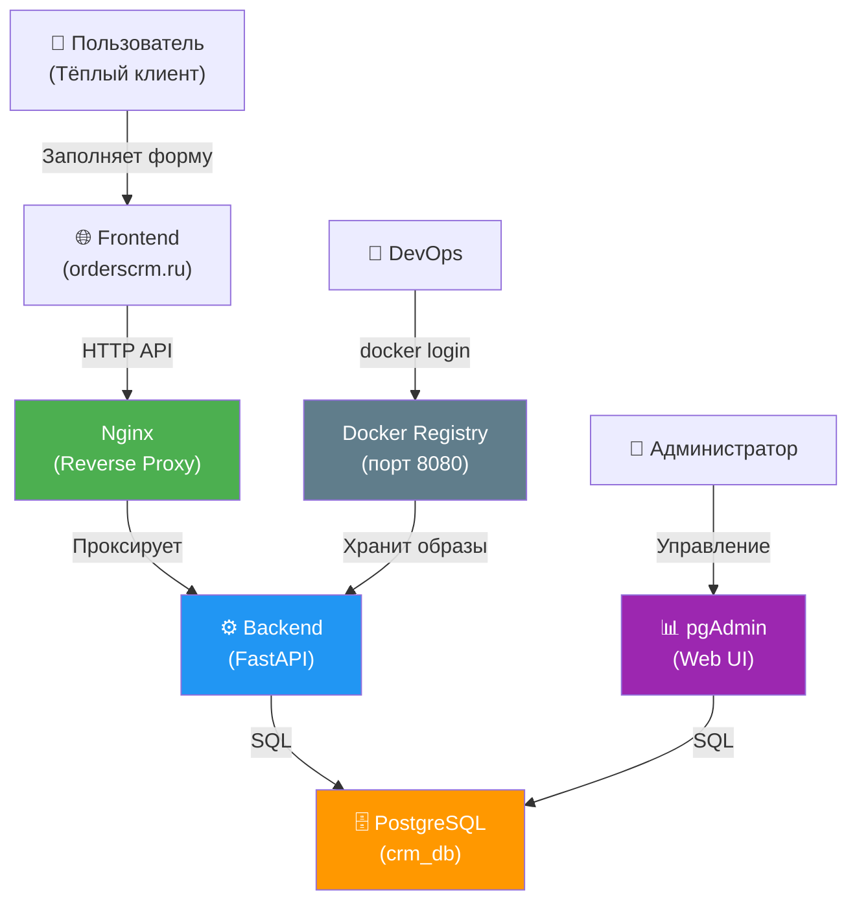
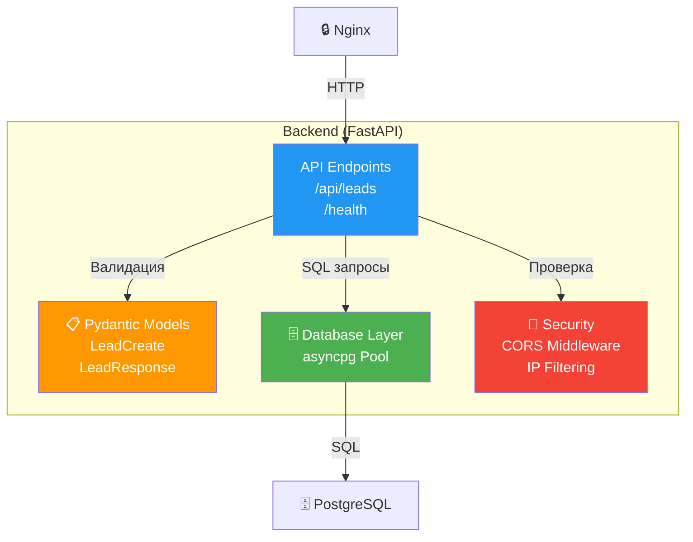
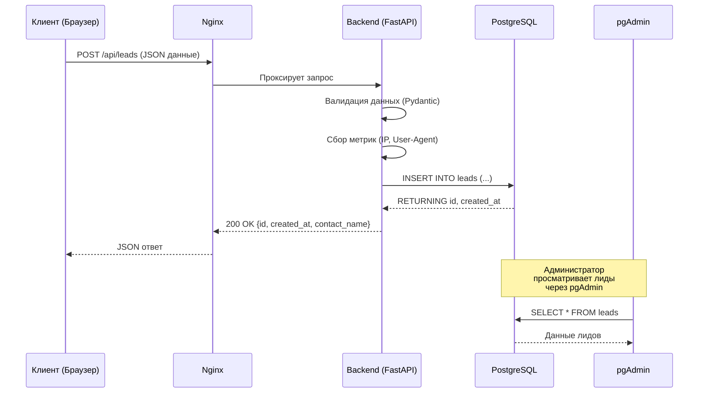
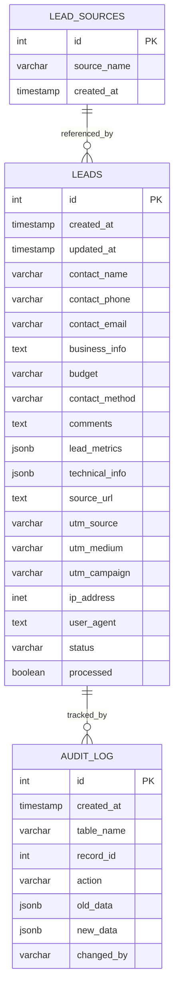
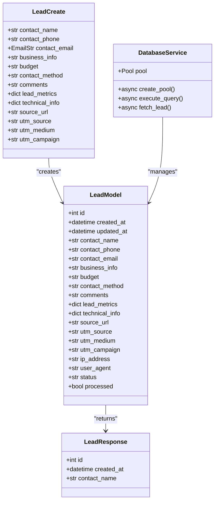

# Orders CRM Backend

## Архитектура системы

### C4 Level 1 - Context Diagram



### C4 Level 2 - Container Diagram


### C4 Level 3 - Component Diagram (Backend)



### UML - Sequence Diagram (Создание лида)



### UML - ER Diagram (База данных)



### UML - Class Diagram (Backend Models)



## Компоненты системы

| Сервис | Образ | Порт | Описание |
|--------|-------|------|----------|
| **Nginx** | nginx:alpine | 80, 443 | Reverse proxy, статика, изоляция API |
| **PostgreSQL** | postgres:16-alpine | 5432 (внутр.) | База данных лидов |
| **pgAdmin** | dpage/pgadmin4:latest | 5050 | Web-интерфейс для управления БД |
| **Docker Registry** | registry:2 | 8080 | Локальный репозиторий образов |

## Быстрый старт

### 1. Подключение к серверу

```bash
# SSH подключение по ключу
ssh -i C:\Users\MV\.ssh\six root@185.87.48.13

# Или через алиас
ssh orderscrm
```

### 2. Проверка контейнеров

```bash
# Список запущенных контейнеров
docker ps

# С красивым форматированием
docker ps --format 'table {{.Names}}\t{{.Status}}\t{{.Ports}}'
```

### 3. Доступ к сервисам

| Сервис | URL | Логин | Пароль |
|--------|-----|-------|--------|
| Сайт | http://185.87.48.13 | - | - |
| pgAdmin | http://185.87.48.13:5050 | admin@orderscrm.ru | admin123 |
| Registry | http://185.87.48.13:8080 | admin | crm_password |
| PostgreSQL | 185.87.48.13:5432 | crm_user | crm_password |

### 4. Работа с Registry

```bash
# Настройка insecure registry (Windows)
# Добавить в %USERPROFILE%\.docker\daemon.json:
{
  "insecure-registries": ["185.87.48.13:8080"]
}

# Перезапустить Docker Desktop

# Логин в registry
docker login 185.87.48.13:8080
# Username: admin
# Password: crm_password

# Пуш образа
docker tag my-backend:latest 185.87.48.13:8080/orders-crm-backend:latest
docker push 185.87.48.13:8080/orders-crm-backend:latest
```

## API Endpoints

### POST /api/leads

Создание нового лида (тёплый клиент).

**Request:**
```json
{
  "contact_name": "Иван Иванов",
  "contact_phone": "+79001234567",
  "contact_email": "ivan@example.com",
  "business_info": "Интернет-магазин одежды",
  "budget": "100000-200000",
  "contact_method": "phone",
  "comments": "Хочу CRM для управления заказами",
  "lead_metrics": {
    "form_fills": 3,
    "time_on_page": 120,
    "scroll_depth": 85
  },
  "technical_info": {
    "browser": "Chrome",
    "os": "Windows",
    "device": "desktop"
  },
  "utm_source": "google",
  "utm_medium": "cpc",
  "utm_campaign": "summer_sale"
}
```

**Response:**
```json
{
  "id": 1,
  "created_at": "2026-05-21T12:00:00Z",
  "contact_name": "Иван Иванов"
}
```

### GET /health

Проверка состояния сервиса.

**Response:**
```json
{"status": "healthy"}
```

## Структура проекта

```
backend/
├── app/
│   ├── main.py          # FastAPI приложение
│   ├── api/             # API endpoints
│   ├── models/          # SQLAlchemy модели
│   ├── schemas/         # Pydantic схемы
│   └── services/        # Бизнес-логика
├── db/
│   └── init.sql         # Инициализация БД
├── nginx/
│   ├── nginx.conf       # Основная конфигурация
│   └── conf.d/
│       └── crm.conf     # Конфиг виртуальных хостов
├── registry/
│   ├── auth/
│   │   ── registry.htpasswd  # Файл авторизации
│   └── create-user.sh   # Скрипт создания пользователя
── docker-compose.yml   # Конфигурация сервисов
├── .env                 # Переменные окружения
├── Dockerfile           # Сборка backend
└── requirements.txt     # Python зависимости
```

## Безопасность

### Изоляция Backend
- Backend недоступен напрямую извне
- Все запросы проходят через Nginx
- Nginx проксирует только `/api/` на backend
- Директива `internal` блокирует внешний доступ

### Сеть
- Все сервисы в изолированной сети `crm_network`
- PostgreSQL доступен только внутри сети
- Открытые порты: 80, 443, 5050, 8080

### Данные
- Все данные хранятся локально
- Резервные копии в `postgres_data` volume
- Аудит изменений в `audit_log` таблице

## Мониторинг

```bash
# Логи всех сервисов
docker compose logs -f

# Логи конкретного сервиса
docker compose logs -f postgres

# Статистика ресурсов
docker stats

# Проверка здоровья PostgreSQL
docker compose exec postgres pg_isready -U crm_user -d crm_db
```

## Резервное копирование

```bash
# Бэкап базы данных
docker compose exec postgres pg_dump -U crm_user crm_db > backup.sql

# Восстановление
docker compose exec -T postgres psql -U crm_user crm_db < backup.sql
```

## Устранение проблем

### Не запускается PostgreSQL
```bash
docker compose logs postgres
docker compose restart postgres
```

### Нет доступа к pgAdmin
```bash
# Проверьте порт
netstat -tuln | grep 5050
```

### Ошибка подключения к Registry
```bash
# Проверьте htpasswd
cat registry/auth/registry.htpasswd
```

### Контейнер перезапускается
```bash
# Проверьте логи
docker logs <container_name>
```

## Следующие шаги

1. ✅ Создать структуру проекта
2. ✅ Настроить PostgreSQL
3. ✅ Настроить Nginx с изоляцией
4. ✅ Настроить Docker Registry
5. ⏳ Добавить Backend сервис в docker-compose
6. ⏳ Настроить SSL/TLS
7. ⏳ Настроить мониторинг
8. ⏳ Добавить CI/CD pipeline