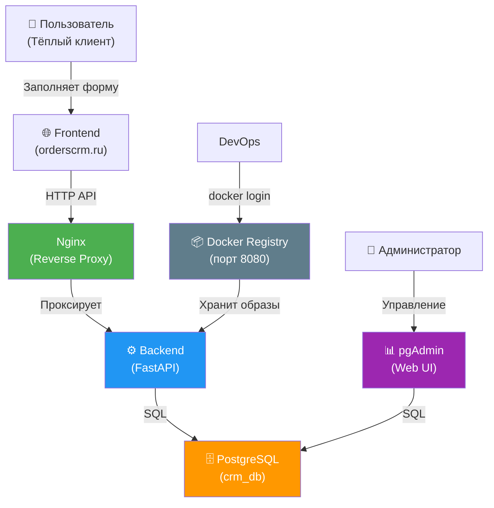
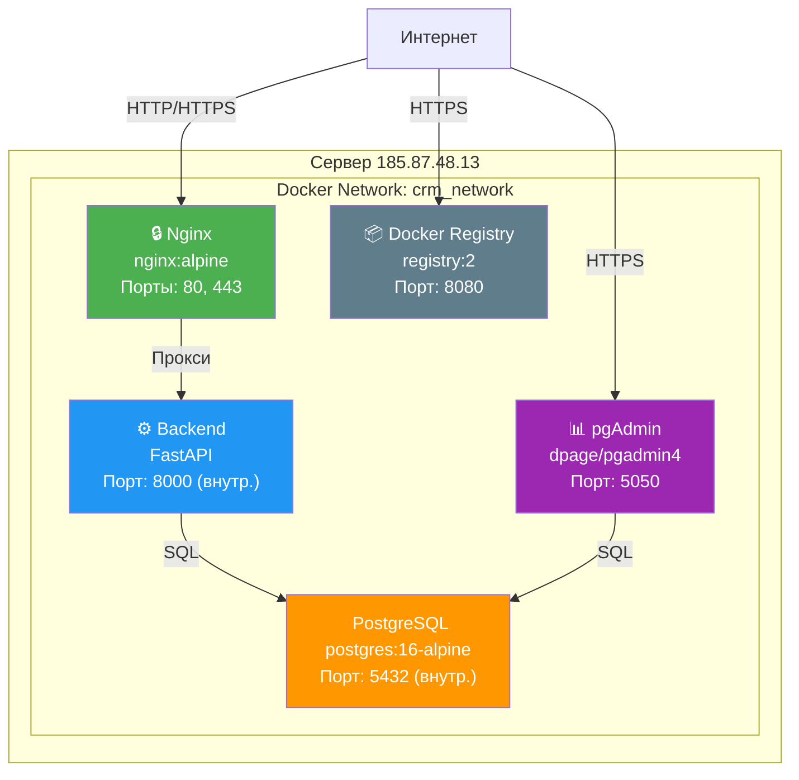
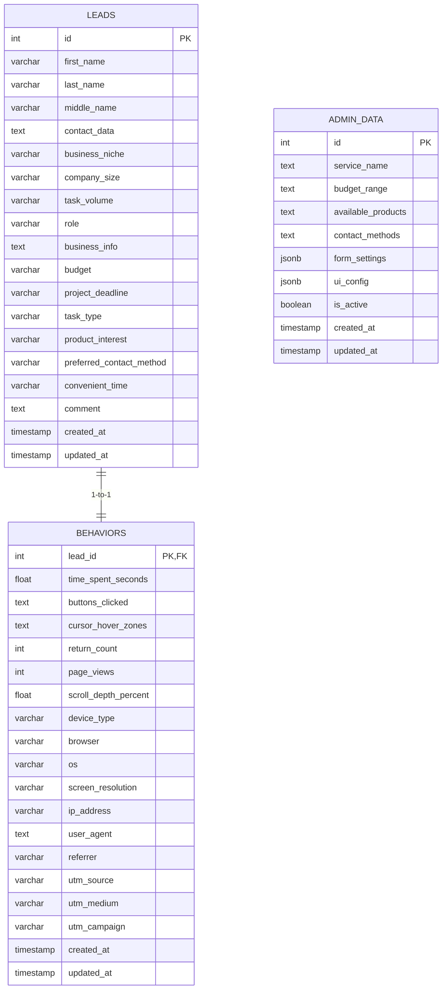
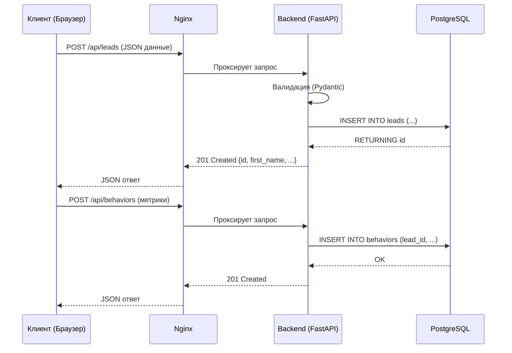

# Orders CRM Backend

## Архитектура системы

### C4 Level 1 - Context Diagram



### C4 Level 2 - Container Diagram



### UML - ER Diagram



### UML - Sequence Diagram (Создание лида)



## Структура проекта

```
backend/
├── app/
│   ├── main.py              # Точка входа, роутер
│   ├── core/
│   │   └── database.py      # Подключение к PostgreSQL
│   ├── models/
│   │   ├── lead.py          # Lead модель + CRUD
│   │   ├── behavior.py      # Behavior модель + CRUD
│   │   └── admin.py         # AdminData модель + CRUD
│   └── routes/
│       ├── lead.py          # Роуты /api/leads
│       ├── behavior.py      # Роуты /api/behaviors
│       └── admin.py         # Роуты /api/admin
├── db/
│   └── init.sql             # Инициализация БД
├── nginx/
│   ├── nginx.conf
│   └── conf.d/crm.conf      # Прокси на backend
├── registry/
│   └── auth/registry.htpasswd
── docker-compose.yml
├── .env
├── Dockerfile
└── requirements.txt
```

## API Endpoints

### Leads

| Метод | Путь | Описание |
|-------|------|----------|
| POST | `/api/leads/` | Создать лид |
| GET | `/api/leads/` | Список лидов |
| GET | `/api/leads/{id}` | Получить лид |
| PUT | `/api/leads/{id}` | Обновить лид |
| DELETE | `/api/leads/{id}` | Удалить лид |

### Behaviors

| Метод | Путь | Описание |
|-------|------|----------|
| POST | `/api/behaviors/` | Создать поведение |
| GET | `/api/behaviors/` | Список поведений |
| GET | `/api/behaviors/{lead_id}` | Получить поведение |
| PUT | `/api/behaviors/{lead_id}` | Обновить поведение |
| DELETE | `/api/behaviors/{lead_id}` | Удалить поведение |

### Admin

| Метод | Путь | Описание |
|-------|------|----------|
| POST | `/api/admin/` | Создать конфиг |
| GET | `/api/admin/` | Список конфигов |
| GET | `/api/admin/active` | Активный конфиг |
| GET | `/api/admin/{id}` | Получить конфиг |
| PUT | `/api/admin/{id}` | Обновить конфиг |
| DELETE | `/api/admin/{id}` | Удалить конфиг |

### Health

| Метод | Путь | Описание |
|-------|------|----------|
| GET | `/health` | Проверка статуса |

## Быстрый старт

### 1. Запуск

```bash
cd backend
docker compose up -d --build
```

### 2. Проверка

```bash
docker ps
curl http://185.87.48.13/health
```

### 3. Доступ к сервисам

| Сервис | URL | Логин | Пароль |
|--------|-----|-------|--------|
| Сайт | http://185.87.48.13 | - | - |
| pgAdmin | http://185.87.48.13:5050 | admin@orderscrm.ru | admin123 |
| Registry | http://185.87.48.13:8080 | admin | crm_password |
| PostgreSQL | 185.87.48.13:5432 | crm_user | crm_password |

## Безопасность

- Backend недоступен напрямую извне
- Все запросы проходят через Nginx
- PostgreSQL доступен только внутри сети
- Данные не покидают сервер

## Registry

```bash
# Логин
docker login 185.87.48.13:8080

# Пуш образа
docker tag orders-crm-backend:latest 185.87.48.13:8080/orders-crm-backend:latest
docker push 185.87.48.13:8080/orders-crm-backend:latest
```
