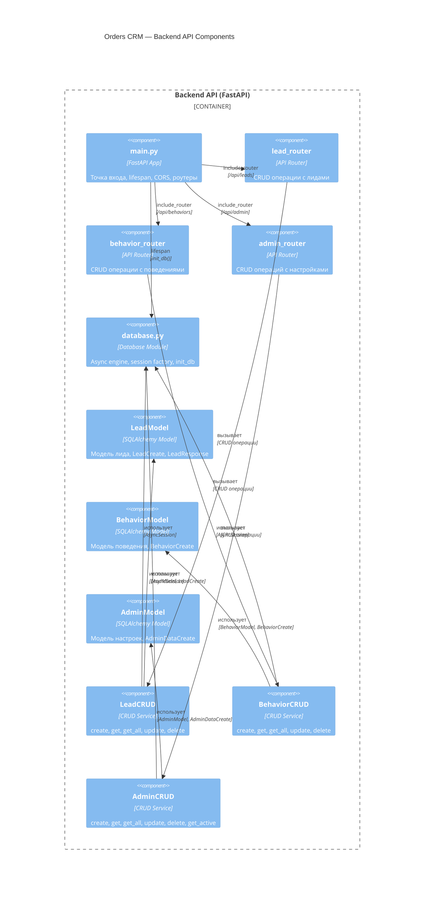

# C4 Component Diagram — Backend API

**Уровень:** Component (Level 3)
**Цель:** Показать компоненты Backend API

## Описание компонентов

| Компонент | Файл | Назначение |
|-----------|------|------------|
| main.py | app/main.py | FastAPI приложение, lifespan, CORS middleware, агрегация роутеров |
| lead_router | app/routes/lead.py | POST /api/leads/, GET /api/leads/, GET /api/leads/{id}, PUT, DELETE |
| behavior_router | app/routes/behavior.py | POST /api/behaviors/, GET /api/behaviors/, GET /api/behaviors/{lead_id}, PUT, DELETE |
| admin_router | app/routes/admin.py | POST /api/admin/, GET /api/admin/, GET /api/admin/active, PUT, DELETE |
| database.py | app/core/database.py | Async engine, session factory, init_db(), Base |
| LeadModel | app/models/lead.py | SQLAlchemy модель + Pydantic схемы (LeadCreate, LeadUpdate, LeadResponse) |
| BehaviorModel | app/models/behavior.py | SQLAlchemy модель + Pydantic схемы |
| AdminModel | app/models/admin.py | SQLAlchemy модель + Pydantic схемы |
| LeadCRUD | app/models/lead.py | create, get, get_all, update, delete для лидов |
| BehaviorCRUD | app/models/behavior.py | create, get, get_all, update, delete для поведений |
| AdminCRUD | app/models/admin.py | create, get, get_all, update, delete, get_active для настроек |
