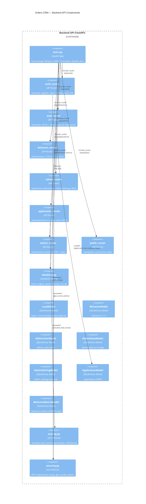

# C4 Component Diagram — Backend API

**Уровень:** Component (Level 3)
**Цель:** Показать компоненты Backend API

## Описание компонентов

| Компонент | Файл | Назначение |
|-----------|------|------------|
| main.py | app/main.py | FastAPI, CORS, lifespan, 7 роутеров, disable_docs |
| auth_router | app/routes/auth.py | POST register/login/refresh, GET check/me |
| lead_router | app/routes/lead.py | CRUD лидов + авто-создание Application |
| behavior_router | app/routes/behavior.py | CRUD поведений (1:1 с Lead) |
| admin_router | app/routes/admin.py | CRUD AdminData + AdminSettings |
| application_router | app/routes/application.py | CRUD + /scored + /stats для заявок |
| metric_router | app/routes/behavior_metric.py | POST метрик + GET /stats |
| public_router | app/routes/public.py | GET /api/public/services (без JWT) |
| database.py | app/core/database.py | Async engine, session factory |
| scoring.py | app/core/scoring.py | 8 критериев, 100 баллов, температура, инсайты |
| security.py | app/core/security.py | JWT (HS256), bcrypt, get_current_admin |
