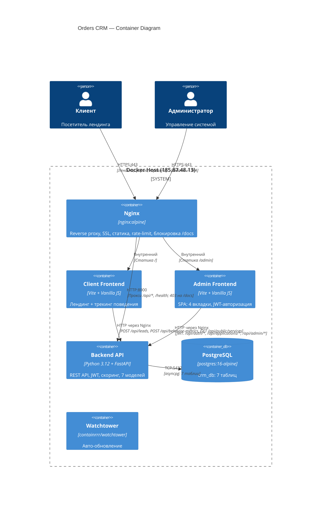

# C4 Container Diagram — Orders CRM

**Уровень:** Container (Level 2)
**Цель:** Показать контейнеры системы и их взаимодействие

## Описание контейнеров

| Контейнер | Технология | Порт | Назначение |
|-----------|------------|------|------------|
| Nginx | nginx:alpine | 80, 443 | Reverse proxy, SSL, rate-limit (10r/s), security headers, блокировка /docs |
| Client Frontend | Vite + Vanilla JS | — | Лендинг: Hero, портфолио, форма + трекинг поведения |
| Admin Frontend | Vite + Vanilla JS | — | SPA: 4 вкладки, JWT, модалки, toast-уведомления |
| Backend API | Python 3.12 + FastAPI | 8000 (внутр.) | 7 роутеров, JWT, скоринг (8 критериев), агрегация |
| PostgreSQL | postgres:16-alpine | 5432 (внутр.) | leads, behaviors, admin_users, admin_data, admin_settings, applications, behavior_metrics |
| Watchtower | containrrr/watchtower | — | Авто-обновление по расписанию |

## Потоки данных

1. **Клиент → Лендинг:** HTTPS → Nginx → статика (Client Frontend)
2. **Клиент → Форма:** POST /api/leads/ → Nginx → Backend → PostgreSQL (Lead + Application)
3. **Клиент → Метрики:** POST /api/behavior-metrics/ → Nginx → Backend → PostgreSQL
4. **Админ → /admin:** HTTPS → Nginx → Admin Frontend (SPA)
5. **Админ → JWT:** POST /api/auth/login → Nginx → Backend → JWT tokens
6. **Админ → API:** JWT-запросы → Nginx → Backend (verify JWT) → PostgreSQL
