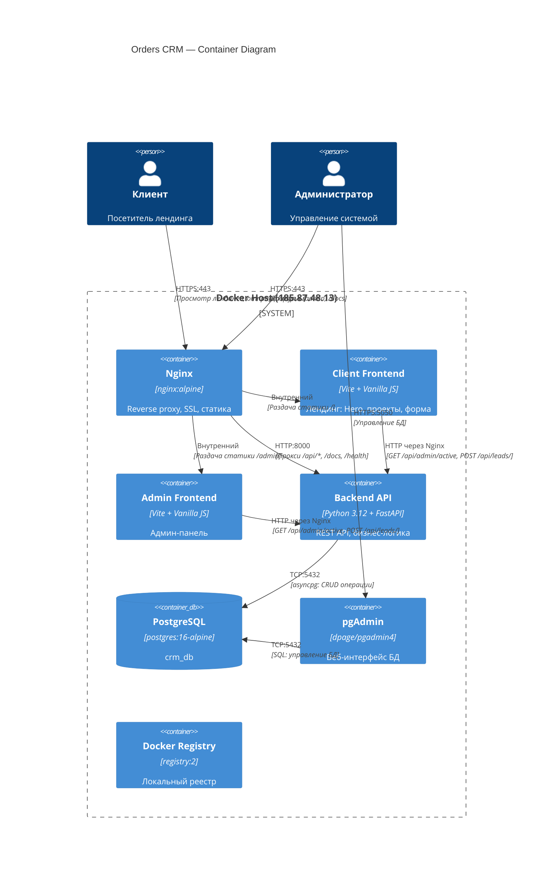

# C4 Container Diagram — Orders CRM

**Уровень:** Container (Level 2)
**Цель:** Показать контейнеры системы и их взаимодействие

## Описание контейнеров

| Контейнер | Технология | Порт | Назначение |
|-----------|------------|------|------------|
| Nginx | nginx:alpine | 80, 443 | Reverse proxy, SSL termination, раздача статики |
| Client Frontend | Vite + Vanilla JS | - | Лендинг: Hero-секция, портфолио, форма заявки |
| Admin Frontend | Vite + Vanilla JS | - | Админ-панель (старая форма) |
| Backend API | Python 3.12 + FastAPI | 8000 (внутренний) | REST API, валидация, бизнес-логика |
| PostgreSQL | postgres:16-alpine | 5432 (внутренний) | Хранение лидов, поведений, настроек |
| pgAdmin | dpage/pgadmin4 | 5050 | Веб-интерфейс для управления БД |
| Docker Registry | registry:2 | 8080 | Локальный реестр Docker-образов |

## Потоки данных

1. **Клиент → Лендинг:** HTTPS запрос → Nginx → Client Frontend (статика)
2. **Клиент → Форма:** Заполнение формы → POST /api/leads/ → Nginx → Backend → PostgreSQL
3. **Админ → /admin:** HTTPS запрос → Nginx → Admin Frontend (статика)
4. **Админ → /docs:** HTTPS запрос → Nginx → Backend (Swagger UI)
5. **Backend → PostgreSQL:** asyncpg подключение → SQL запросы → результаты
