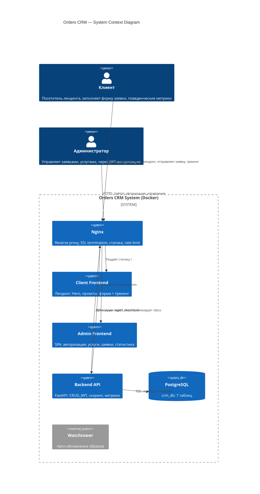

# C4 Context Diagram — Orders CRM

**Уровень:** System Context (Level 1)
**Цель:** Показать систему и её взаимодействие с внешними акторами

## Описание акторов

| Актор | Роль | Взаимодействие |
|-------|------|----------------|
| Клиент | Посетитель | Заполняет форму, отправляет метрики поведения |
| Администратор | Управление | JWT-авторизация, CRUD услуг, просмотр заявок и статистики |

## Описание систем

| Система | Технология | Назначение |
|---------|------------|------------|
| Nginx | nginx:alpine | Reverse proxy, SSL, статика, rate-limit (10r/s) |
| Client Frontend | Vite + Vanilla JS | Лендинг + трекинг поведения (behavior-metrics.js) |
| Admin Frontend | Vite + Vanilla JS | SPA: 4 вкладки (услуги, лиды, CRM, статистика) |
| Backend API | FastAPI + SQLAlchemy | REST API, скоринг, JWT, агрегация метрик |
| PostgreSQL | postgres:16-alpine | 7 таблиц: leads, behaviors, admin_users, admin_data, admin_settings, applications, behavior_metrics |
| Watchtower | containrrr/watchtower | Автоматическое обновление Docker-образов |
