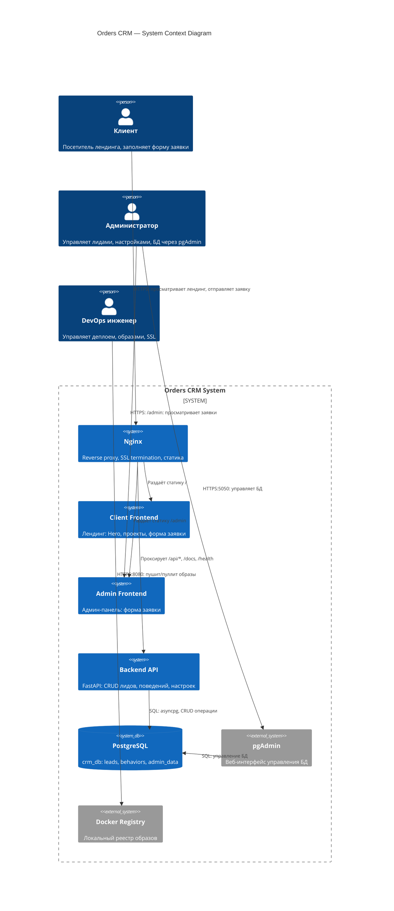

# C4 Context Diagram — Orders CRM

**Уровень:** System Context (Level 1)
**Цель:** Показать систему и её взаимодействие с внешними акторами

## Описание акторов

| Актор | Роль | Взаимодействие |
|-------|------|----------------|
| Клиент | Посетитель | Заполняет форму на лендинге, отправляет заявку |
| Администратор | Управление | Просматривает заявки через /admin, управляет БД через pgAdmin |
| DevOps | Инфраструктура | Деплой, SSL, Docker Registry |

## Описание систем

| Система | Технология | Назначение |
|---------|------------|------------|
| Nginx | nginx:alpine | Reverse proxy, SSL, раздача статики |
| Client Frontend | Vite + Vanilla JS | Лендинг с формой заявки |
| Admin Frontend | Vite + Vanilla JS | Админ-панель |
| Backend API | FastAPI + SQLAlchemy | REST API для лидов и поведений |
| PostgreSQL | postgres:16-alpine | Хранение данных |
| pgAdmin | dpage/pgadmin4 | Управление БД |
| Docker Registry | registry:2 | Локальный реестр образов |
