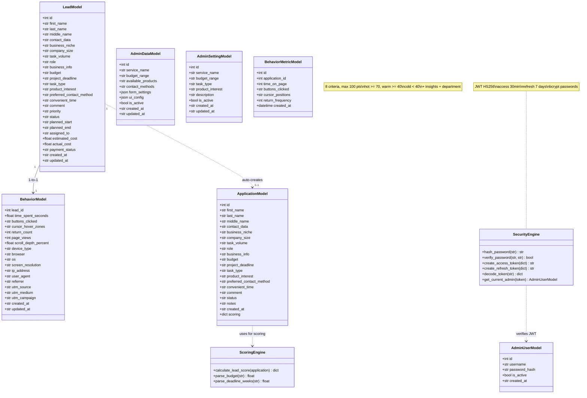

# UML Class Diagram — Backend Models

**Цель:** Показать классы моделей и их отношения

## Описание классов

### Модели данных (SQLAlchemy)

| Класс | Таблица | Файл | Назначение |
|-------|---------|------|------------|
| LeadModel | leads | app/models/lead.py | Сырые заявки + поля планирования/стоимости |
| BehaviorModel | behaviors | app/models/behavior.py | Поведение (1:1 с Lead) |
| AdminUserModel | admin_users | app/models/admin_user.py | Администраторы (bcrypt, JWT) |
| AdminDataModel | admin_data | app/models/admin.py | Настройки фронтенда |
| AdminSettingModel | admin_settings | app/models/admin_settings.py | Услуги компании |
| ApplicationModel | applications | app/models/application.py | Заявки CRM (со скорингом runtime) |
| BehaviorMetricModel | behavior_metrics | app/models/behavior_metric.py | Анонимные метрики (INSERT-only) |

### Core-модули

| Класс | Файл | Назначение |
|-------|------|------------|
| ScorigngEngine | app/core/scoring.py | 8 критериев скоринга, 100 баллов |
| SecurityEngine | app/core/security.py | JWT (HS256), bcrypt, get_current_admin |
