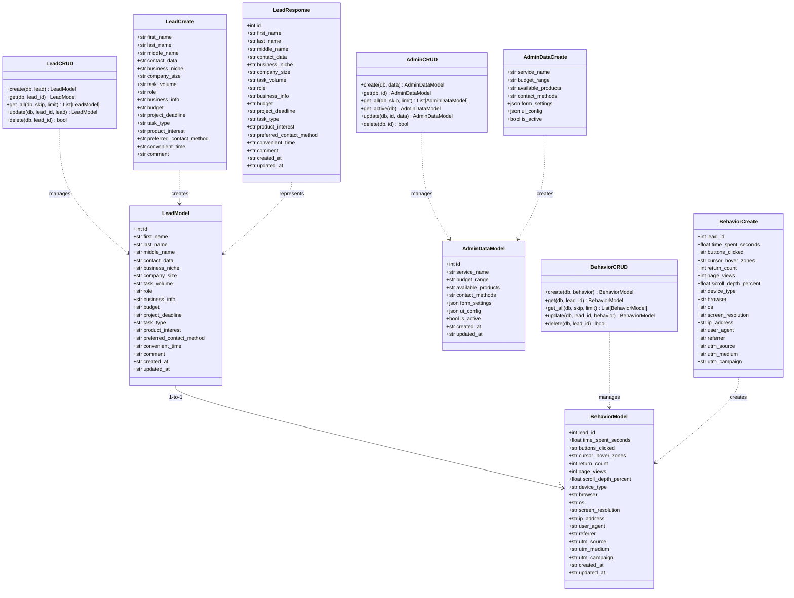

# UML Class Diagram — Backend Models

**Цель:** Показать классы моделей и их отношения

## Описание классов

### Модели данных

| Класс | Файл | Назначение |
|-------|------|------------|
| LeadModel | app/models/lead.py | SQLAlchemy модель таблицы leads |
| BehaviorModel | app/models/behavior.py | SQLAlchemy модель таблицы behaviors |
| AdminDataModel | app/models/admin.py | SQLAlchemy модель таблицы admin_data |

### Pydantic схемы

| Класс | Файл | Назначение |
|-------|------|------------|
| LeadCreate | app/models/lead.py | Входная схема для создания лида |
| LeadResponse | app/models/lead.py | Выходная схема для ответа |
| BehaviorCreate | app/models/behavior.py | Входная схема для создания поведения |
| AdminDataCreate | app/models/admin.py | Входная схема для создания настроек |

### CRUD сервисы

| Класс | Файл | Назначение |
|-------|------|------------|
| LeadCRUD | app/models/lead.py | CRUD операции для лидов |
| BehaviorCRUD | app/models/behavior.py | CRUD операции для поведений |
| AdminCRUD | app/models/admin.py | CRUD операции для настроек |
