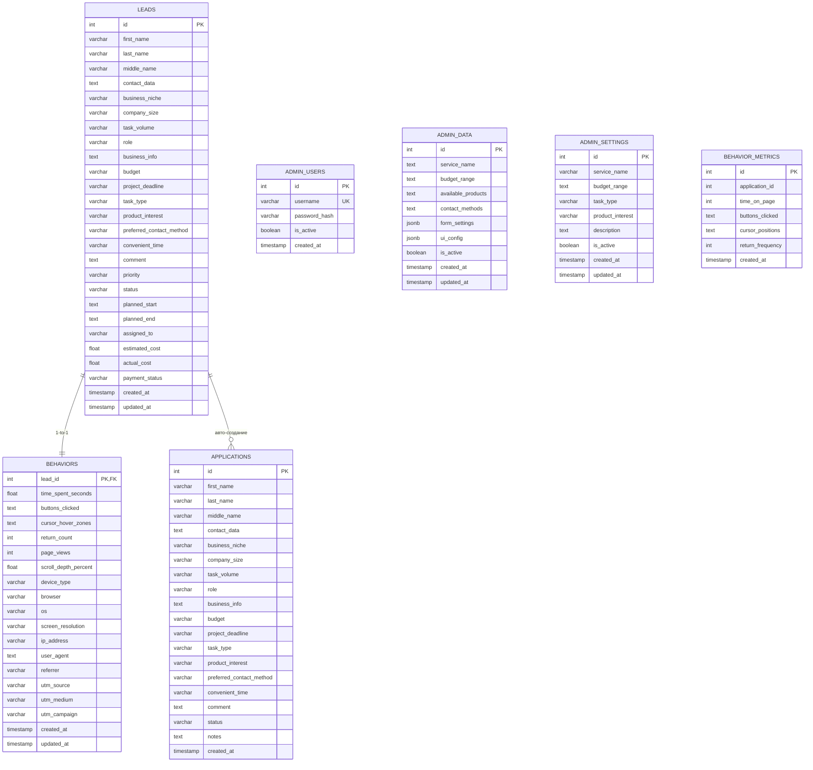

# UML ER Diagram — Database Schema

**Цель:** Показать структуру базы данных и связи между таблицами

## Описание таблиц

### LEADS

| Колонка | Тип | Описание |
|---------|-----|----------|
| id | SERIAL PK | Уникальный идентификатор |
| first_name | VARCHAR(255) | Имя клиента |
| last_name | VARCHAR(255) | Фамилия |
| contact_data | TEXT | Email/телефон |
| priority | VARCHAR | Приоритет (low/medium/high) |
| status | VARCHAR | Статус (Новая/В работе/Архив) |
| planned_start/end | TEXT | Планируемые даты |
| assigned_to | VARCHAR | Ответственный |
| estimated/actual_cost | FLOAT | Смета/факт |
| payment_status | VARCHAR | Статус оплаты |

### BEHAVIORS

1:1 связь с LEADS по lead_id.

### ADMIN_USERS

| Колонка | Тип | Описание |
|---------|-----|----------|
| username | VARCHAR(255) UK | Логин администратора |
| password_hash | VARCHAR(255) | bcrypt хеш |
| is_active | BOOLEAN | Активен |

### ADMIN_DATA

Настройки для клиентского фронтенда.

### ADMIN_SETTINGS

Услуги компании (CRUD через админ-панель).

### APPLICATIONS

Структурированные заявки для CRM. Авто-создаются при POST /api/leads/.
Поле `scoring` — runtime (не хранится в БД).

### BEHAVIOR_METRICS

Анонимные метрики, INSERT-only, без FK.

## Индексы

| Таблица | Индекс | Колонка |
|---------|--------|---------|
| leads | idx_leads_created_at | created_at DESC |
| leads | idx_leads_last_name | last_name |
| behaviors | idx_behaviors_lead_id | lead_id |
| admin_settings | idx_admin_settings_service_name | service_name |
| behavior_metrics | idx_metrics_created_at | created_at DESC |
| applications | idx_applications_status | status |
