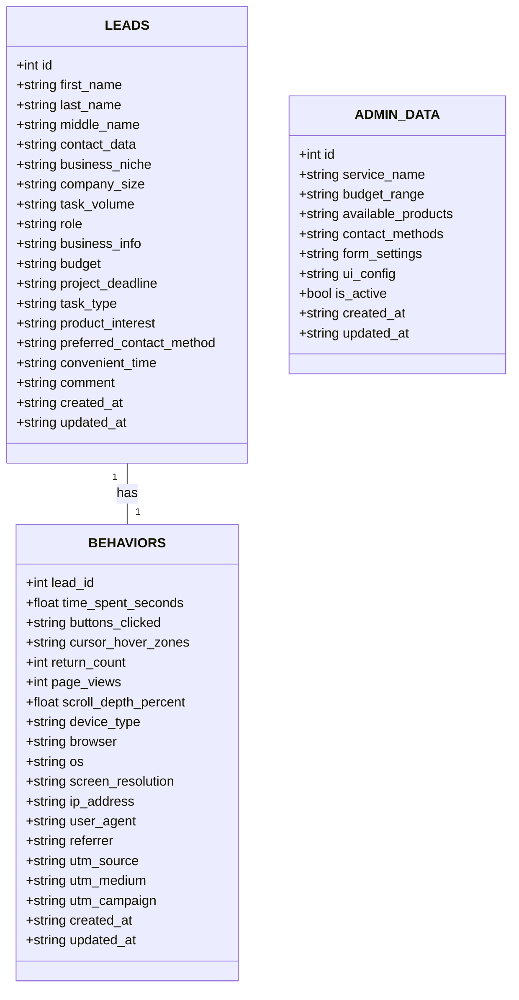

# UML ER Diagram — Database Schema

**Цель:** Показать структуру базы данных и связи между таблицами

## Описание таблиц

### LEADS

| Колонка | Тип | Ограничения | Описание |
|---------|-----|-------------|----------|
| id | SERIAL | PK | Уникальный идентификатор |
| first_name | VARCHAR(255) | NOT NULL | Имя клиента |
| last_name | VARCHAR(255) | NOT NULL | Фамилия клиента |
| middle_name | VARCHAR(255) | | Отчество клиента |
| contact_data | TEXT | NOT NULL | Email или телефон |
| business_niche | VARCHAR(255) | | Ниша бизнеса |
| company_size | VARCHAR(100) | | Размер компании |
| task_volume | VARCHAR(255) | | Объём задачи |
| role | VARCHAR(100) | | Роль (Сотрудник/Руководитель) |
| business_info | TEXT | | Информация о бизнесе |
| budget | VARCHAR(100) | | Бюджет |
| project_deadline | VARCHAR(255) | | Срок реализации |
| task_type | VARCHAR(255) | | Тип задачи |
| product_interest | VARCHAR(255) | | Интересующий продукт |
| preferred_contact_method | VARCHAR(100) | | Способ связи |
| convenient_time | VARCHAR(100) | | Удобное время |
| comment | TEXT | | Комментарий |
| created_at | TEXT | | Дата создания |
| updated_at | TEXT | | Дата обновления |

### BEHAVIORS

| Колонка | Тип | Ограничения | Описание |
|---------|-----|-------------|----------|
| lead_id | INTEGER | PK, FK → leads.id | Связь с лидом |
| time_spent_seconds | FLOAT | | Время на странице |
| buttons_clicked | TEXT | | JSON кликов |
| cursor_hover_zones | TEXT | | JSON hover-зон |
| return_count | INTEGER | DEFAULT 0 | Количество возвратов |
| page_views | INTEGER | DEFAULT 0 | Количество просмотров |
| scroll_depth_percent | FLOAT | | Глубина скролла |
| device_type | VARCHAR(50) | | Тип устройства |
| browser | VARCHAR(100) | | Браузер |
| os | VARCHAR(100) | | Операционная система |
| screen_resolution | VARCHAR(20) | | Разрешение экрана |
| ip_address | VARCHAR(45) | | IP адрес |
| user_agent | TEXT | | User-Agent строка |
| referrer | VARCHAR(500) | | Реферер |
| utm_source | VARCHAR(255) | | UTM source |
| utm_medium | VARCHAR(255) | | UTM medium |
| utm_campaign | VARCHAR(255) | | UTM campaign |
| created_at | TEXT | | Дата создания |
| updated_at | TEXT | | Дата обновления |

### ADMIN_DATA

| Колонка | Тип | Ограничения | Описание |
|---------|-----|-------------|----------|
| id | SERIAL | PK | Уникальный идентификатор |
| service_name | TEXT | | Список услуг (через запятую) |
| budget_range | TEXT | | JSON диапазона бюджета |
| available_products | TEXT | | Список продуктов |
| contact_methods | TEXT | | Способы связи |
| form_settings | TEXT | | Настройки формы |
| ui_config | TEXT | | Конфигурация UI |
| is_active | BOOLEAN | DEFAULT TRUE | Активная запись |
| created_at | TEXT | | Дата создания |
| updated_at | TEXT | | Дата обновления |

## Индексы

| Таблица | Индекс | Колонка |
|---------|--------|---------|
| leads | idx_leads_created_at | created_at DESC |
| leads | idx_leads_last_name | last_name |
| behaviors | idx_behaviors_lead_id | lead_id |
