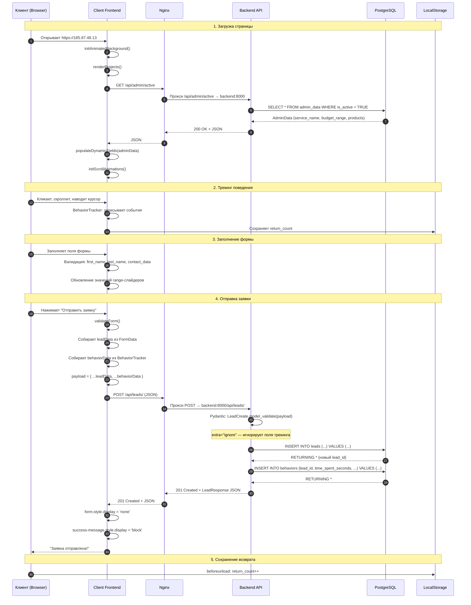

# UML Sequence Diagram — Lead Submission

**Цель:** Показать процесс отправки заявки клиентом

## Этапы процесса

| # | Этап | Описание |
|---|------|----------|
| 1 | Загрузка страницы | Инициализация анимаций, проектов, загрузка AdminData |
| 2 | Трекинг поведения | Запись кликов, скролла, hover-зон, возвратов |
| 3 | Заполнение формы | Валидация обязательных полей, обновление слайдеров |
| 4 | Отправка заявки | POST /api/leads/ с lead + behavior данными |
| 5 | Сохранение возврата | Увеличение return_count в localStorage |

## Обработка ошибок

| Ошибка | Причина | Действие |
|--------|---------|----------|
| 422 Unprocessable Entity | Невалидные данные | Показать ошибку валидации |
| 500 Internal Server Error | Ошибка БД | Показать "Произошла ошибка" |
| Network Error | Нет соединения | Показать "Попробуйте позже" |
