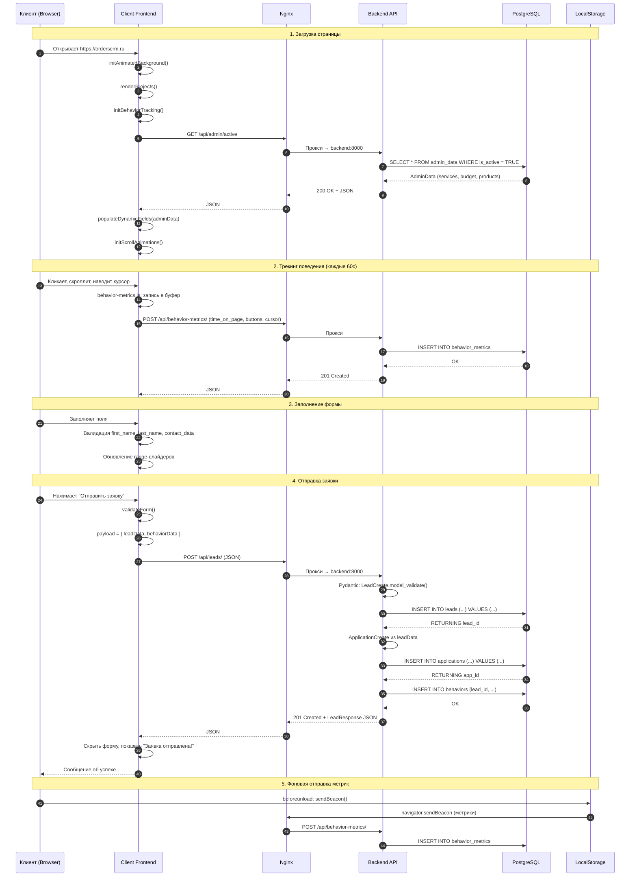

# UML Sequence Diagram — Lead Submission

**Цель:** Показать процесс отправки заявки клиентом и последующей обработки

## Этапы процесса

| # | Этап | Описание |
|---|------|----------|
| 1 | Загрузка страницы | Инициализация анимаций, проектов, трекинга, загрузка AdminData |
| 2 | Фоновый трекинг | Каждые 60с: time_on_page, buttons, cursor_positions → behavior_metrics |
| 3 | Заполнение формы | Валидация полей, слайдеры |
| 4 | Отправка заявки | Lead → Application (авто) → Behavior → ответ |
| 5 | Закрытие страницы | sendBeacon с финальными метриками |

## Авто-создание Application

При создании Lead, бэкенд автоматически создаёт запись в `applications` с теми же данными. Это позволяет:
- Разделить сырые лиды (лендинг) и структурированные заявки (CRM)
- Применить скоринг к заявкам без изменения логики лендинга
- Вести независимый статус и заметки в CRM

## Обработка ошибок

| Ошибка | Причина | Действие |
|--------|---------|----------|
| 422 | Невалидные данные | Показать ошибку валидации |
| 500 | Ошибка БД | Показать "Произошла ошибка" |
| Network Error | Нет соединения | Показать "Попробуйте позже" |
